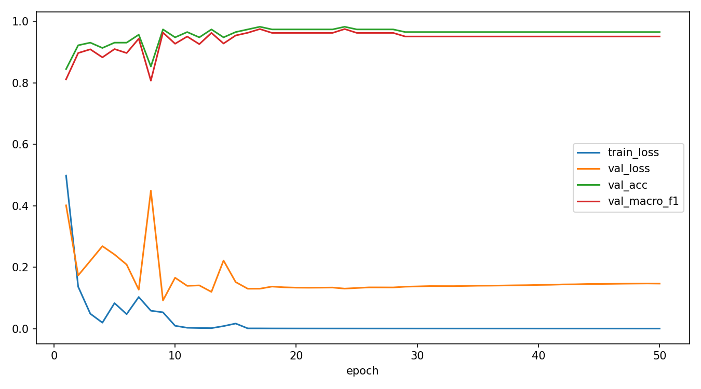
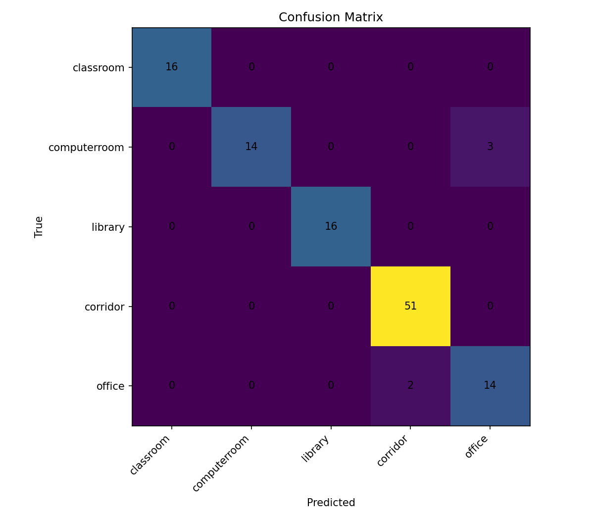

# CSC4005 Lab 5 Report – Vision Transformer for Smart Campus Scene Classification

## 1. Thông tin nhóm

| Họ tên | Mã sinh viên | Lớp |
|---|---|---|
| Lưu Thanh Tùng | 1771040029 | KHMT-1701 |
| Nguyễn Hoàng Anh | 1771040002 | KHMT-1701 |

- Link GitHub repo: https://github.com/FIT-DNU-CS-16-01/fit-dnu-cs-16-01-17-01-csc4005-csc4005_lab5-csc4005_lab5_mit_indoor_starter_kit
- Link W&B project: https://wandb.ai/thanhtung-contact-official-/csc4005-lab6-mit-indoor-vit
- Link W&B run tốt nhất: https://wandb.ai/thanhtung-contact-official-/csc4005-lab6-mit-indoor-vit/runs/giytbsjq

## 2. Mô tả bài toán

Bài toán của Lab 5 là phân loại ảnh ngữ cảnh trong hệ thống Smart Campus bằng Vision Transformer trên subset 5 lớp của bộ dữ liệu MIT Indoor Scenes 67. Ảnh đầu vào được phân loại vào một trong các lớp `classroom`, `computerroom`, `library`, `corridor`, `office`. Bài toán này phù hợp với bối cảnh Smart Campus vì hệ thống camera trong trường có thể cần tự động nhận diện loại không gian để hỗ trợ giám sát, điều phối hoặc phân tích dữ liệu. Khác với CNN, ViT xem ảnh như một chuỗi các patch, từ đó học quan hệ toàn cục giữa các vùng ảnh thông qua self-attention.

## 3. Dữ liệu

| Nội dung | Mô tả |
|---|---|
| Dataset gốc | MIT Indoor Scenes 67 |
| Subset sử dụng | `classroom`, `computerroom`, `library`, `corridor`, `office` |
| Tổng số ảnh | 789 |
| Train/Val/Test split | 557 / 116 / 116 |
| Tiền xử lý | resize 224x224, normalization ImageNet, augmentation nhẹ cho train set |
| Đường dẫn dữ liệu khi chạy | `data/indoorCVPR_09/Images` |

Thống kê số ảnh theo lớp:

| Lớp | Tổng ảnh | Train | Validation | Test |
|---|---:|---:|---:|---:|
| classroom | 113 | 81 | 16 | 16 |
| computerroom | 114 | 80 | 17 | 17 |
| library | 107 | 75 | 16 | 16 |
| corridor | 346 | 244 | 51 | 51 |
| office | 109 | 77 | 16 | 16 |

Nhận xét ngắn: dữ liệu bị lệch tương đối mạnh ở lớp `corridor`. Điều này giúp mô hình thấy nhiều biến thể của hành lang hơn, nhưng cũng tạo rủi ro thiên lệch nếu mô hình chỉ dựa vào tần suất lớp.

## 4. Mô hình và cấu hình thí nghiệm

Kiến trúc ViT trong bài lab:

```text
image → patch embedding → positional embedding → transformer encoder → classification head
```

Cấu hình của run tốt nhất `1771040029_vit_finetune_e50`:

| Thành phần | Giá trị |
|---|---|
| model_name | `vit_b_16` |
| train_mode | `finetune` |
| img_size | 224 |
| batch size | 8 |
| số epoch | 50 |
| learning rate | 0.00005 |
| optimizer | AdamW |
| weight decay | 0.0001 |
| dropout | 0.2 |
| total params | 85,802,501 |
| trainable params | 85,802,501 |
| trainable ratio | 1.0 |
| thiết bị | GPU CUDA |

Các run đã thực hiện để so sánh:

| Run | Mô hình | Train mode | Augment | LR | Test acc | Test macro-F1 |
|---|---|---|---|---:|---:|---:|
| `vit_b16_head_only` | ViT-B/16 | `head_only` | Có | 0.001 | 93.97% | 0.9193 |
| `1771040029_vit_finetune_e50` | ViT-B/16 | `finetune` | Có | 0.00005 | 95.69% | 0.9465 |
| `1771040029_vit_head_only_noaug_e50` | ViT-B/16 | `head_only` | Không | 0.001 | 93.10% | 0.9072 |
| `1771040029_vit_finetune_lowlr_e50` | ViT-B/16 | `finetune` | Có | 0.00002 | 95.69% | 0.9433 |
| `1771040029_resnet18_head_only_e50` | ResNet18 | `head_only` | Có | 0.001 | 87.93% | 0.8424 |

## 5. Kết quả

Kết quả của run tốt nhất `1771040029_vit_finetune_e50`:

| Metric | Validation | Test |
|---|---:|---:|
| Accuracy | 98.28% | 95.69% |
| Macro-F1 | 0.9754 | 0.9465 |
| Best epoch | 17 | 17 |
| Test loss | - | 0.1270 |

Nhận xét nhanh từ learning curve:

- Train loss giảm rất nhanh về gần 0 sau khoảng 15 epoch.
- Validation macro-F1 đạt đỉnh ở epoch 17 rồi gần như đi ngang.
- Sau epoch 17, mô hình không còn cải thiện đáng kể trên validation, vì vậy checkpoint tốt nhất nằm khá sớm dù tổng số epoch là 50.

Ảnh learning curves của run tốt nhất:



Ảnh confusion matrix của run tốt nhất:



## 6. Phân tích lỗi

1. Lớp mô hình dự đoán tốt nhất là `classroom`, `library` và `corridor`, vì cả ba lớp này đều được dự đoán đúng toàn bộ trên test set của run tốt nhất.
2. Lớp dễ bị nhầm nhất là `computerroom` và `office`.
3. Cặp nhầm lẫn rõ nhất là `computerroom → office` với 3 ảnh, và `office → corridor` với 2 ảnh. Điều này hợp lý vì `computerroom` và `office` đều là không gian trong nhà có bàn ghế, màn hình, bố cục làm việc; còn một số ảnh `office` có thể chứa không gian mở hoặc góc nhìn gần hành lang nên bị nhầm sang `corridor`.
4. Dữ liệu có mất cân bằng tương đối rõ, vì lớp `corridor` có 346 ảnh trong khi các lớp còn lại chỉ khoảng 107 đến 114 ảnh.
5. Augmentation có giúp cải thiện. So với `head_only` không augmentation, bản `head_only` có augmentation tăng `test_macro_f1` từ 0.9072 lên 0.9193, tức tăng khoảng 0.0122.

So sánh mở rộng với CNN cho thấy ResNet18 nhanh hơn nhiều nhưng độ chính xác thấp hơn ViT. ResNet18 đạt `test_macro_f1 = 0.8424`, trong khi ViT finetune đạt 0.9465. Thời gian một epoch trung bình xấp xỉ như sau:

| Run | Thời gian epoch trung bình |
|---|---:|
| `vit_b16_head_only` | 23.36 giây |
| `1771040029_vit_finetune_e50` | 32.51 giây |
| `1771040029_resnet18_head_only_e50` | 8.14 giây |

Điều này cho thấy ViT tốn tài nguyên hơn CNN, nhưng bù lại mô hình nắm bắt ngữ cảnh toàn cục tốt hơn trên bài toán scene classification.

## 7. Liên hệ với lý thuyết ViT

1. Patch embedding trong ViT tương tự bước token embedding trong NLP. Thay vì ánh xạ từ của câu sang vector, ViT ánh xạ từng patch ảnh sang vector đặc trưng.
2. ViT cần positional embedding vì self-attention bản thân không mang thông tin thứ tự hay vị trí. Nếu không có positional embedding, mô hình sẽ biết có những patch nào nhưng không biết chúng nằm ở đâu trong ảnh.
3. `head_only` train nhanh hơn `finetune` vì chỉ cập nhật một phần rất nhỏ tham số ở classification head, còn backbone pretrained được giữ nguyên.
4. Nên fine-tune toàn bộ backbone khi dữ liệu đủ chất lượng, GPU đủ mạnh, và cần đẩy hiệu năng cao hơn so với baseline `head_only`.
5. Classification head có nhiệm vụ biến biểu diễn cuối cùng của ảnh thành logits cho 5 lớp đích.

## 8. Bằng chứng W&B

- Link project: https://wandb.ai/thanhtung-contact-official-/csc4005-lab6-mit-indoor-vit
- Link baseline `head_only`: xem run lưu trong project với output local tại `outputs/vit_b16_head_only/`
- Link run tốt nhất `finetune`: https://wandb.ai/thanhtung-contact-official-/csc4005-lab6-mit-indoor-vit/runs/giytbsjq
- Link run `head_only` không augmentation: https://wandb.ai/thanhtung-contact-official-/csc4005-lab6-mit-indoor-vit/runs/pk93asgd
- Link run `finetune` low learning rate: https://wandb.ai/thanhtung-contact-official-/csc4005-lab6-mit-indoor-vit/runs/8of78m19
- Link run CNN đối chứng: https://wandb.ai/thanhtung-contact-official-/csc4005-lab6-mit-indoor-vit/runs/v7mjy1su

Các hyperparameter chính được log:

- `model_name`
- `train_mode`
- `epochs`
- `batch_size`
- `lr`
- `weight_decay`
- `dropout`
- `augment`
- `total_params`
- `trainable_params`

Các metric được log:

- `train_loss`
- `val_loss`
- `train_acc`
- `val_acc`
- `val_macro_f1`
- `lr`
- `epoch_time_sec`
- `test_acc`
- `test_macro_f1`
- `best_val_macro_f1`

## 9. Kết luận

Nhóm đã hoàn thành pipeline phân loại ảnh Smart Campus bằng Vision Transformer trên subset 5 lớp của MIT Indoor Scenes 67. Baseline `head_only` đạt kết quả khá tốt, nhưng `finetune` toàn bộ ViT-B/16 cho kết quả tốt nhất với `test_acc = 95.69%` và `test_macro_f1 = 0.9465`. Augmentation giúp cải thiện bản `head_only`, còn giảm learning rate trong `finetune` không mang lại cải thiện test rõ rệt. So sánh mở rộng với ResNet18 cho thấy CNN chạy nhanh hơn đáng kể nhưng thua ViT rõ ràng về độ chính xác và macro-F1. Nếu cải thiện thêm, hướng hợp lý là phân tích sâu các mẫu bị nhầm giữa `computerroom`, `office` và `corridor`, đồng thời thử thêm regularization hoặc chiến lược fine-tune từng phần để giảm chi phí huấn luyện mà vẫn giữ hiệu năng tốt.
